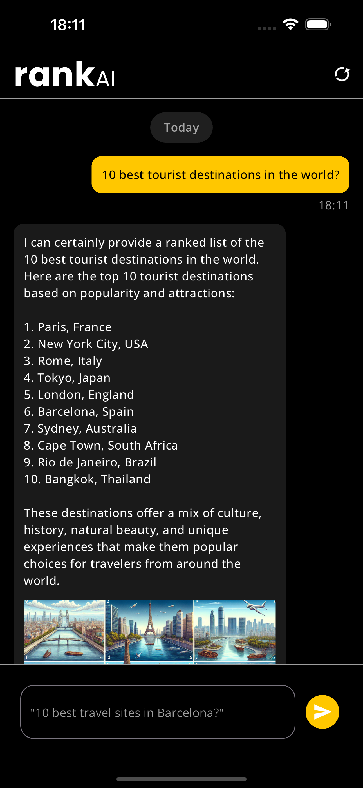

English | [Spanish](README.es.md)

# RankAI

RankAI Mobile app developed with Flutter and the OpenAI API. The purpose of this app is to provide the user with rankings regarding all sorts of topics. It's powered by the ChatGPT 3.5 turbo model for completions and the DALL-E 3 for image generation. It generates images based on the latest rank provided. Built in accordance with Flutter's BLoC pattern and Clean Arch principles, below are the main packages used and their responsibility:

- State Management: flutter_bloc, more specifically Cubits
- Local Storage: hydrated_bloc and path_provider
- Dependency Injection: get_it
- Internationalization: intl and flutter_localizations
- HTTP requests: Dio
- Navigation: go_router
- Testing: mocktail

<p float="left">
  
   
  
</p>


## Run Instructions

To run the app:

1. Install [Flutter](https://docs.flutter.dev/get-started/install)

2. Generate a secret API Key from [OpenAI](https://openai.com/api/)

3. Copy the generated API Key and the Organization ID (you can find the organization ID [here](https://platform.openai.com/settings/organization/general)).
   
4. Create a `.env` file in the project's root folder and paste your keys in the format below (more info on handling environment variables [here](https://pub.dev/packages/flutter_dotenv)):

```
API_ORGANIZATION = YOUR_ORGANIZATION_ID_HERE
API_KEY = YOUR_KEY_HERE
```

5. Run `flutter gen-l10n` to generate the `AppLocalizations` files. We currently support both English and Spanish languages!

6. Run the app with `flutter run`. It works on both Android and iOS!

### Flutter Version

```
Doctor summary (to see all details, run flutter doctor -v):
[✓] Flutter (Channel stable, 3.19.6, on macOS 14.4.1 23E224 darwin-arm64, locale en-GB)
[✓] Android toolchain - develop for Android devices (Android SDK version 32.0.0-rc1)
[✓] Xcode - develop for iOS and macOS (Xcode 15.3)
[✓] Chrome - develop for the web
[✓] Android Studio (version 2023.2)
[✓] VS Code (version 1.88.0)
[✓] Connected device (5 available)            
[✓] Network resources
```
